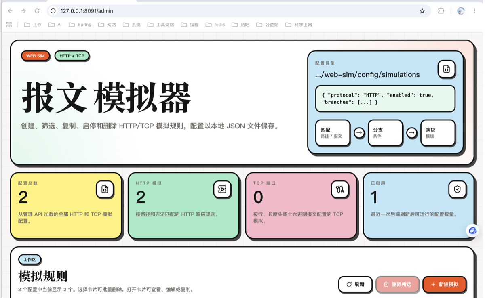
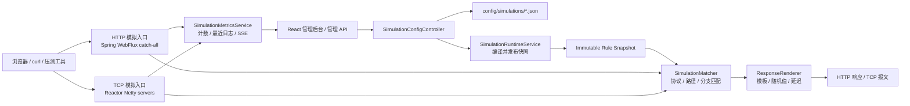

# web-sim

<p align="center">
  
</p>

<p align="center">
  <a href="https://spring.io/projects/spring-boot"></a>
  
  
  
  
  
</p>

<p align="center">
  <a href="#快速启动">快速启动</a> ·
  <a href="#功能总览">功能总览</a> ·
  <a href="#http-模拟示例">HTTP 示例</a> ·
  <a href="#tcp-模拟示例">TCP 示例</a> ·
  <a href="#性能与百万并发说明">百万并发说明</a>
</p>

`web-sim` 是一个面向本地开发、联调、测试环境和压测前置验证的轻量 HTTP/TCP 接口模拟器。它参考 `web-router` 的轻量架构和卡片式前端体验，把每个模拟请求保存为本地 JSON 配置，并通过 Spring Boot WebFlux、Reactor Netty 与 React 管理后台实现“配置即改即生效”。

当前版本：`0.1.3`。

## 功能总览

| 功能 | 当前行为 |
| --- | --- |
| 管理后台 | `GET /admin` 打开中文 React 管理后台；`GET /` 自动跳转到 `/admin`。 |
| 卡片式模拟 | 每个 HTTP/TCP 模拟规则以卡片呈现，支持创建、编辑、复制、启停、删除、详情查看和批量删除。 |
| 标签与搜索 | 每个卡片可配置自定义标签；管理台支持按标签下拉筛选，并可按名称模糊搜索配置。 |
| HTTP 模拟 | 按 `method + path` 匹配，支持 `EXACT`、`PREFIX`、`TEMPLATE` 路径模式与路径变量。 |
| TCP 模拟 | 基于 Reactor Netty 启动 TCP 监听；当前真实支持 line-based 报文，保留 `LENGTH_HEADER`、`HEX` 配置枚举。 |
| 分支报文 | 支持按 query/header/path/body/tcp body 条件匹配不同分支，配置优先级、延迟、响应头、响应体和错误码。 |
| 交错响应 | 单个分支可配置 `responseVariants`，并通过 `ROUND_ROBIN` 或 `RANDOM` 在正常报文、异常报文和错误码之间交错返回；也可在分支上临时关闭变体。 |
| 随机值模板 | 响应 body/header 支持 `{{random.uuid}}`、`{{random.int:min,max}}`、`{{random.pick:a,b,c}}`、请求参数和路径变量。 |
| 错误码模拟 | HTTP 状态码支持 `100..999`，可模拟 `400/401/403/404/429/500/502/503/504` 以及自定义业务状态。 |
| 运行日志与指标 | 内存采样最近请求，管理台可查看 HTTP/TCP/error 计数、平均耗时和 SSE 日志快照。 |
| 导入导出 | 管理台支持导出全部模拟配置为 JSON，也可导入导出的 `configs` 包、配置数组或单个配置对象。 |
| 本地配置热部署 | 每条规则保存为 `config/simulations/<id>.json`；管理台或直接修改 JSON 文件后，会热加载为不可变运行时快照并原子替换。 |
| 高并发设计 | WebFlux 非阻塞 HTTP + Reactor Netty TCP + 不可变规则快照；百万级并发目标通过多实例集群和 OS/JVM 调优承载。 |

## 技术栈

| 类型 | 技术 |
| --- | --- |
| 运行框架 | Spring Boot 3.5.2 |
| HTTP 运行时 | Spring WebFlux |
| TCP 运行时 | Reactor Netty |
| 管理后台 | React 19 + Vite 7 + TypeScript |
| UI 风格 | Tailwind CSS + Radix UI primitives + clay/chunky 卡片视觉 |
| 配置存储 | 本地 JSON 文件 |
| 构建工具 | Maven + npm |
| Java 版本 | JDK 21 |

## 架构概览



核心目录：

| 目录 | 说明 |
| --- | --- |
| `src/main/java/com/geek/websim/web/controller` | 管理 API、HTTP catch-all、日志 API 和页面入口。 |
| `src/main/java/com/geek/websim/web/model` | 模拟配置、条件、响应、DTO 和枚举模型。 |
| `src/main/java/com/geek/websim/runtime` | 匹配器、模板渲染、随机值、规则快照和 HTTP/TCP 运行时适配。 |
| `src/main/java/com/geek/websim/runtime/tcp` | TCP 服务生命周期与报文处理。 |
| `frontend/src` | React 中文管理台源码。 |
| `src/main/resources/static/admin` | 已构建的管理台静态资源，便于直接通过 Spring Boot 访问。 |
| `config/simulations` | 本地 JSON 配置存储目录；仓库仅保留 `.gitkeep`。 |

## 快速启动

要求：JDK 21+、Maven 3.9+、Node.js 20+。

```bash
# 验证后端
mvn test

# 首次从源码构建管理台静态资源
cd frontend
npm install
npm run build
cd ..

# 启动后端与内置管理台
mvn spring-boot:run
```

默认监听所有网卡：`0.0.0.0:9998`，可通过本机实际 IP 访问。

启动后访问：

- 管理后台：<http://localhost:9998/admin>
- 健康检查：<http://localhost:9998/actuator/health>
- 指标快照：<http://localhost:9998/admin/api/logs/snapshot>

前端开发模式：

```bash
cd frontend
npm run dev
```

Vite 默认访问 `http://127.0.0.1:5174`（监听 `0.0.0.0:5174`，局域网内可通过本机 IP 访问），并把 `/admin/api` 代理到后端 `9998`。

发布包运行方式：

```bash
# 生成 Linux/macOS tar.gz、Windows zip 以及可执行 Spring Boot JAR
scripts/build-dist.sh --with-tests

# Linux/macOS
tar -xzf target/web-sim-0.1.3.tar.gz
cd web-sim-0.1.3
./run.sh
./stop.sh

# Windows
# 解压 target/web-sim-0.1.3.zip 后，在 web-sim-0.1.3 目录执行：
run.bat
stop.bat
```

## HTTP 模拟示例

创建一个 HTTP 模拟接口：

```bash
curl -X POST http://localhost:9998/admin/api/simulations \
  -H 'Content-Type: application/json' \
  -d '{
    "name": "用户详情模拟",
    "protocol": "HTTP",
    "enabled": true,
    "tags": ["联调", "用户域"],
    "http": {"method": "GET", "path": "/api/users/{id}", "matchMode": "TEMPLATE"},
    "requestTemplate": {"headers": {}, "query": {}, "body": null},
    "branches": [
      {
        "name": "按参数返回错误",
        "priority": 10,
        "conditions": [{"source": "QUERY", "key": "error", "operator": "EQ", "value": "true"}],
        "response": {"status": 500, "headers": {"Content-Type": "application/json"}, "body": "{\"code\":\"SIM_ERROR\"}", "delayMs": 0}
      }
    ],
    "defaultResponse": {
      "status": 200,
      "headers": {"Content-Type": "application/json", "X-Trace-Id": "{{random.uuid}}"},
      "body": "{\"id\":\"{{path.id}}\",\"name\":\"{{random.name}}\"}",
      "delayMs": 0
    }
  }'
```

调用模拟接口：

```bash
curl http://localhost:9998/api/users/42
curl 'http://localhost:9998/api/users/42?error=true'
```

## 交错响应示例

单个模拟分支可以在正常响应、异常报文和错误码之间交错返回：

```json
{
  "name": "库存查询交错返回",
  "priority": 5,
  "conditions": [
    {"source": "QUERY", "key": "sku", "operator": "EXISTS", "value": ""}
  ],
  "variantStrategy": "ROUND_ROBIN",
  "responseVariantsEnabled": true,
  "responseVariants": [
    {
      "status": 200,
      "headers": {"Content-Type": "application/json"},
      "body": "{\"available\":true,\"qty\":{{random.int:1,50}}}",
      "delayMs": 20
    },
    {
      "status": 200,
      "headers": {"Content-Type": "application/json"},
      "body": "{\"available\":false,\"reason\":\"OUT_OF_STOCK\"}",
      "delayMs": 20
    },
    {
      "status": 503,
      "headers": {"Content-Type": "application/json", "Retry-After": "3"},
      "body": "{\"code\":\"SERVICE_UNAVAILABLE\",\"traceId\":\"{{random.uuid}}\"}",
      "delayMs": 100
    }
  ],
  "response": {"status": 200, "headers": {}, "body": "{}", "delayMs": 0}
}
```

`ROUND_ROBIN` 使用线程安全计数器轮询；`RANDOM` 在每次命中时随机选择一个响应变体。

## TCP 模拟示例

创建一个 line-based TCP 模拟：

```bash
curl -X POST http://localhost:9998/admin/api/simulations \
  -H 'Content-Type: application/json' \
  -d '{
    "name": "TCP echo 模拟",
    "protocol": "TCP",
    "enabled": true,
    "tcp": {"host": "0.0.0.0", "port": 19001, "frameMode": "LINE"},
    "requestTemplate": {"headers": {}, "query": {}, "body": null},
    "branches": [
      {
        "name": "ping",
        "priority": 10,
        "conditions": [{"source": "TCP_BODY", "key": null, "operator": "CONTAINS", "value": "ping"}],
        "response": {"status": 200, "headers": {}, "body": "pong {{random.uuid}}", "delayMs": 0}
      }
    ],
    "defaultResponse": {"status": 200, "headers": {}, "body": "echo: {{tcp.body}}", "delayMs": 0}
  }'
```

调用：

```bash
printf 'ping\n' | nc 127.0.0.1 19001
printf 'hello\n' | nc 127.0.0.1 19001
```

## 模板与随机值

响应 body 和 header 支持 `{{...}}` 占位符：

| 占位符 | 说明 |
| --- | --- |
| `{{random.uuid}}` | UUID |
| `{{random.int:min,max}}` | 闭区间整数，例如 `{{random.int:1,100}}` |
| `{{random.float:min,max}}` | 浮点数，例如 `{{random.float:0,1}}` |
| `{{random.bool}}` | `true` / `false` |
| `{{random.timestamp}}` | 当前 ISO 时间 |
| `{{random.pick:a,b,c}}` | 从列表中随机选一个值 |
| `{{random.name}}` | 示例姓名 |
| `{{request.header.X-Trace}}` | 请求头 |
| `{{query.keyword}}` | query 参数 |
| `{{path.id}}` | TEMPLATE 路径变量 |
| `{{tcp.body}}` | TCP 报文文本 |

## 条件和错误码

条件来源：`QUERY`、`HEADER`、`PATH`、`BODY`、`TCP_BODY`。

条件操作符：`EQ`、`NOT_EQ`、`CONTAINS`、`REGEX`、`EXISTS`、`JSON_PATH`。

常见错误码可直接放在任意分支或响应变体的 `status` 中：

| 状态码 | 模拟场景 | 响应 body 示例 |
| --- | --- | --- |
| `400` | 参数错误 | `{"code":"BAD_REQUEST","message":"invalid parameter"}` |
| `401` | 未登录/凭证无效 | `{"code":"UNAUTHORIZED"}` |
| `403` | 权限不足 | `{"code":"FORBIDDEN"}` |
| `404` | 资源不存在 | `{"code":"NOT_FOUND"}` |
| `429` | 限流 | `{"code":"TOO_MANY_REQUESTS"}` |
| `500` | 依赖内部异常 | `{"code":"INTERNAL_ERROR"}` |
| `502` | 上游网关错误 | `{"code":"BAD_GATEWAY"}` |
| `503` | 服务暂不可用 | `{"code":"SERVICE_UNAVAILABLE"}` |
| `504` | 上游超时 | `{"code":"GATEWAY_TIMEOUT"}` |

## API 速查

| 方法 | 路径 | 说明 |
| --- | --- | --- |
| `GET` | `/admin/api/simulations` | 配置列表 |
| `GET` | `/admin/api/simulations/{id}` | 配置详情 |
| `GET` | `/admin/api/simulations/{id}/raw` | 原始 JSON 文件内容 |
| `GET` | `/admin/api/simulations/export` | 导出全部配置 JSON |
| `POST` | `/admin/api/simulations/import` | 导入配置 JSON |
| `POST` | `/admin/api/simulations` | 创建配置 |
| `PUT` | `/admin/api/simulations/{id}` | 更新配置 |
| `DELETE` | `/admin/api/simulations/{id}` | 删除配置 |
| `POST` | `/admin/api/simulations/{id}/toggle` | 启停配置 |
| `GET` | `/admin/api/logs/snapshot` | 指标与最近日志快照 |
| `GET` | `/admin/api/logs/stream` | SSE 日志快照流 |

## 配置热部署

- 默认监听 `web-sim.config-dir` 指向的目录，`*.json` 创建、修改或删除后会自动重新编译规则并刷新 HTTP/TCP 运行时。
- `web-sim.hot-reload-enabled=false` 可关闭文件监听；`web-sim.hot-reload-debounce-ms` 控制文件变更后的防抖时间，默认 `500` 毫秒。
- 热部署失败时会继续使用上一份可用运行时快照，并在日志中记录失败原因。

## 性能与百万并发说明

单进程使用 WebFlux/Reactor Netty、不可变规则快照和低开销采样日志来减少阻塞与锁竞争。但“百万并发请求”不是单靠应用代码即可保证的指标，生产环境至少需要：

- 多实例水平扩展，前置 L4/L7 负载均衡。
- 调整 OS 参数：`ulimit -n`、ephemeral port、TCP backlog、连接跟踪、内核队列等。
- 合理 JVM 参数、堆/直接内存、GC 策略和容器资源限制。
- 禁用或降低热路径日志采样，控制响应 body 大小和延迟模拟。
- 使用压测工具分布式发压，并按 HTTP/TCP、连接复用、报文大小分别建模。

建议把本项目作为单节点模拟运行时，百万级目标通过集群和基础设施调优实现。

## 开发与验证

```bash
# 后端测试 / 打包
mvn test
mvn package

# 前端验证
cd frontend
npm run test -- --run
npm run typecheck
npm run build
cd ..

# 生成分发目录
./scripts/build-dist.sh
```

## 文档入口

- [设计说明](./docs/superpowers/specs/2026-07-07-web-sim-design.md)：需求背景、核心模型和架构设计。
- [实现计划](./docs/superpowers/plans/2026-07-07-web-sim-implementation.md)：分阶段实现任务记录。

## 许可证

当前仓库未声明许可证。如需对外发布，请先补充明确的 LICENSE 文件。
