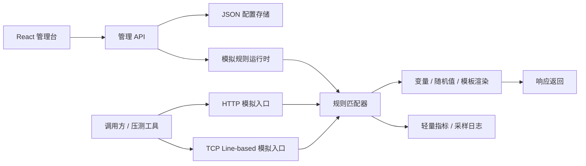

# web-sim 完整全栈模拟器设计

日期：2026-07-07
状态：已确认设计，待实现计划

## 1. 背景与目标

`web-sim` 是参考 `web-router` 架构和前端框架构建的 Web/TCP 请求模拟器。它面向本地开发、联调、压测前置验证和测试环境，支持把一个模拟请求以一个卡片形式管理，并能动态配置请求匹配、分支报文、随机返回值、错误码和延迟。

第一版采用完整全栈形态：Spring Boot 后端真实监听 HTTP/TCP 请求，React 管理台负责配置管理。系统按单机高并发实现，并为百万级集群扩展预留架构能力；不承诺单机百万 QPS 或单机百万长连接。

## 2. 非目标

- 第一版不实现真实单机百万 QPS/百万长连接 SLA。
- 第一版 TCP 真实支持换行文本协议，不实现 length-header 和 hex 二进制协议的完整解析。
- 第一版不引入数据库、服务注册中心或集中配置中心。
- 第一版不实现权限系统、多租户和审计审批。

## 3. 技术路线

选择“轻量单体版 + 协议边界预留”：

- 后端使用 Spring Boot 3.5、WebFlux、Reactor Netty。
- 不引入 Spring Cloud Gateway，因为模拟器不是代理路由器，避免额外路由层开销。
- 前端参考 `web-router`：React 19、Vite、Tailwind、shadcn 风格组件、卡片式管理台。
- 配置存储使用本地 JSON 文件，每个模拟规则一个文件，目录为 `config/simulations/*.json`。
- HTTP/TCP 在运行时编译成不可变内存快照，配置变更后原子替换。

## 4. 总体架构



## 5. 核心规则模型

每个模拟卡片对应一个 `SimulationConfig`。核心字段如下：

```json
{
  "id": "sim-20260707120000-abc123",
  "name": "用户查询接口",
  "tags": ["联调", "用户域"],
  "protocol": "HTTP",
  "enabled": true,
  "http": {
    "method": "GET",
    "path": "/api/users/{id}",
    "matchMode": "TEMPLATE"
  },
  "tcp": {
    "host": "127.0.0.1",
    "port": 19001,
    "frameMode": "LINE"
  },
  "requestTemplate": {
    "headers": {},
    "query": {},
    "body": ""
  },
  "branches": [
    {
      "name": "正常返回",
      "priority": 10,
      "responseVariantsEnabled": true,
      "conditions": [
        { "source": "query", "key": "status", "operator": "eq", "value": "ok" }
      ],
      "response": {
        "status": 200,
        "headers": { "Content-Type": "application/json" },
        "body": "{\"id\":\"{{path.id}}\",\"name\":\"{{random.name}}\"}",
        "delayMs": 0
      }
    },
    {
      "name": "异常返回",
      "priority": 20,
      "conditions": [
        { "source": "query", "key": "status", "operator": "eq", "value": "fail" }
      ],
      "response": {
        "status": 500,
        "body": "{\"error\":\"模拟服务异常\"}"
      }
    }
  ],
  "defaultResponse": {
    "status": 404,
    "body": "{\"error\":\"未匹配模拟分支\"}"
  }
}
```

### 5.1 协议字段

- `protocol`：`HTTP` 或 `TCP`。
- `tags`：可选自定义标签数组，用于管理后台卡片展示和标签筛选。
- HTTP：
  - `method`：GET/POST/PUT/PATCH/DELETE/ANY。
  - `path`：匹配路径。
  - `matchMode`：`EXACT`、`PREFIX`、`TEMPLATE`。
- TCP：
  - `host`：监听 IP，默认 `127.0.0.1`。
  - `port`：监听端口。
  - `frameMode`：第一版真实支持 `LINE`，预留 `LENGTH_HEADER` 和 `HEX`。

### 5.2 分支与默认响应

- `branches` 按 `priority` 从小到大匹配。
- 命中第一个分支即返回。
- 未命中任何分支时返回 `defaultResponse`。
- HTTP 响应支持 status、headers、body、delayMs。
- TCP 响应使用 `body` 作为返回报文文本；错误码可放在返回报文字段中表达。

## 6. 请求匹配逻辑

### 6.1 HTTP 匹配

1. 过滤启用的 HTTP 规则。
2. 匹配 method；`ANY` 匹配所有方法。
3. 匹配 path：
   - `EXACT`：完全匹配。
   - `PREFIX`：前缀匹配。
   - `TEMPLATE`：如 `/api/users/{id}`，匹配并提取路径变量。
4. 匹配分支条件。
5. 渲染并返回响应。

### 6.2 TCP 匹配

1. 按监听端口找到启用的 TCP 规则组。
2. 第一版以换行作为一次请求报文边界。
3. 对报文文本执行条件匹配。
4. 返回命中的响应报文文本。

TCP 条件第一版支持：

- `contains`
- `regex`
- `eq`
- `jsonPath`（可选高成本匹配，默认建议少用）

### 6.3 条件字段

条件格式：

```json
{ "source": "query", "key": "status", "operator": "eq", "value": "ok" }
```

`source` 支持：

- `query`
- `header`
- `path`
- `body`
- `tcpBody`

`operator` 支持：

- `eq`
- `notEq`
- `contains`
- `regex`
- `exists`
- `jsonPath`

## 7. 模板与随机值

响应体、响应头值和 TCP 返回报文支持模板变量：

- `{{random.uuid}}`
- `{{random.int:1,100}}`
- `{{random.float:0,1}}`
- `{{random.bool}}`
- `{{random.timestamp}}`
- `{{random.pick:SUCCESS,FAIL,TIMEOUT}}`
- `{{request.header.X-Trace-Id}}`
- `{{query.userId}}`
- `{{path.id}}`
- `{{tcp.body}}`

模板在配置刷新时预编译，运行时只做低成本替换。

## 8. 后端模块划分

```text
src/main/java/com/geek/websim
├── Application.java
├── common
│   ├── result/Result.java
│   ├── exception/BusinessException.java
│   └── enums/ErrorCodeEnum.java
├── config
│   ├── SimulationProperties.java
│   └── WebSimRuntimeInitializer.java
├── web
│   ├── controller
│   │   ├── HomeController.java
│   │   ├── SimulationConfigController.java
│   │   ├── SimulationLogController.java
│   │   └── HttpSimulationController.java
│   ├── model
│   │   ├── entity/SimulationConfig.java
│   │   └── dto/SimulationConfigDto.java
│   └── service
│       ├── SimulationConfigService.java
│       ├── SimulationRuntimeService.java
│       ├── SimulationMetricsService.java
│       └── impl/SimulationConfigServiceImpl.java
├── runtime
│   ├── SimulationRuleSnapshot.java
│   ├── SimulationMatcher.java
│   ├── BranchMatcher.java
│   ├── ResponseRenderer.java
│   ├── RandomValueProvider.java
│   ├── http/HttpSimulationHandler.java
│   └── tcp/TcpSimulationServerManager.java
```

### 8.1 关键职责

- `SimulationConfigService`：JSON 配置 CRUD、校验、ID 生成、冲突检查。
- `SimulationRuntimeService`：把配置编译成不可变运行时快照并原子替换。
- `SimulationMatcher`：HTTP/TCP 共用规则匹配入口。
- `BranchMatcher`：执行条件分支匹配。
- `ResponseRenderer`：渲染模板变量、随机值、延迟。
- `TcpSimulationServerManager`：按端口启动、停止 Reactor Netty TCP server。
- `SimulationMetricsService`：轻量指标、采样日志、最近请求摘要。

## 9. 管理 API

管理 API 统一挂载在 `/admin/api`，返回结构沿用 `Result<T>`。

- `GET /admin/api/simulations`：列表。
- `GET /admin/api/simulations/{id}`：详情。
- `GET /admin/api/simulations/{id}/raw`：原始 JSON。
- `POST /admin/api/simulations`：创建。
- `PUT /admin/api/simulations/{id}`：更新。
- `DELETE /admin/api/simulations/{id}`：删除。
- `POST /admin/api/simulations/{id}/toggle`：启停。
- `GET /admin/api/logs/snapshot`：指标快照。
- `GET /admin/api/logs/stream`：SSE 采样日志流。

HTTP 模拟入口避开 `/admin/**`、`/actuator/**` 和静态资源路径。

## 10. 前端页面结构

```text
frontend/src
├── App.tsx
├── features/simulations
│   ├── types.ts
│   ├── sim-utils.ts
│   ├── SimulationToolbar.tsx
│   ├── SimulationCard.tsx
│   ├── SimulationFormDialog.tsx
│   ├── SimulationDetailDrawer.tsx
│   └── DeleteConfirmDialog.tsx
├── features/logs
│   ├── types.ts
│   └── SimulationLogDialog.tsx
├── components/ui
└── lib/api.ts
```

### 10.1 页面布局

- 顶部 Hero：`WEB SIMULATOR CONTROL`。
- 概览卡：
  - 配置总数。
  - HTTP 模拟数。
  - TCP 模拟数。
  - 启用数。
- 工具栏：
  - 按名称模糊搜索。
  - 标签下拉筛选。
  - 新增模拟。
  - 批量删除。
- 卡片列表：一个模拟请求一个卡片。
- 详情抽屉：基础信息、协议配置、请求匹配、响应分支、默认响应、原始 JSON 预览。

### 10.2 卡片字段

- 名称。
- 协议：HTTP/TCP。
- 启用状态。
- 自定义标签。
- HTTP：method + path。
- TCP：host + port + frameMode。
- 分支数。
- 默认错误码。
- 命中次数、错误次数、采样平均耗时。
- 操作：启停、复制、详情、删除。

## 11. 高并发与百万级扩展策略

第一版目标是单机尽量高并发，并可通过集群扩展到百万级请求能力：

- 请求热路径不访问数据库、不读写配置文件。
- 配置刷新后构建不可变快照，读请求使用原子引用，无锁读取。
- HTTP/TCP runtime 与管理 API 逻辑分离。
- 日志默认采样，不保存完整百万级请求明细。
- 统计使用低开销计数器，避免每请求大量对象分配。
- 响应模板在配置刷新时预编译。
- 条件表达式在配置刷新时预解析。
- 大 body 设置默认大小限制，避免内存被打爆。
- 提供压测模式配置：关闭管理台、关闭详细日志、降低采样率。
- 后续横向扩展：多实例模拟节点、共享配置仓库、负载均衡、独立指标采集。

## 12. 测试策略

### 12.1 后端单元测试

- 配置 CRUD。
- HTTP path 模板匹配。
- 条件分支优先级。
- 模板随机值渲染。
- TCP line frame 解析。
- 配置冲突校验。

### 12.2 后端集成测试

- HTTP 模拟接口返回 200、400、404、500。
- TCP line-based 请求返回对应报文。
- 配置更新后运行时快照刷新。
- 禁用规则不再命中。

### 12.3 前端测试

- 表单字段校验。
- 卡片过滤。
- JSON 格式化。
- 分支编辑基本交互。

### 12.4 压测验证

- README 提供 `wrk` HTTP 压测示例。
- README 提供 `netcat` 或脚本 TCP 冒烟测试。
- README 明确说明百万级需要集群、机器规格和系统参数配合。

## 13. 验收标准

- 可以在管理台创建、编辑、复制、删除、启停 HTTP/TCP 模拟规则。
- HTTP 模拟规则能按 method/path/query/header/body 条件返回不同分支。
- TCP 第一版能按换行文本请求返回配置的响应报文。
- 支持随机值和请求变量模板。
- 支持返回常见 HTTP 错误码，如 400、401、403、404、429、500、502、503、504。
- 每个模拟请求以卡片形式呈现，并显示基础指标。
- 配置保存在本地 JSON 文件中，重启后可恢复。
- 配置更新后运行时规则即时刷新。
- README 说明启动、配置、HTTP/TCP 使用和压测注意事项。
